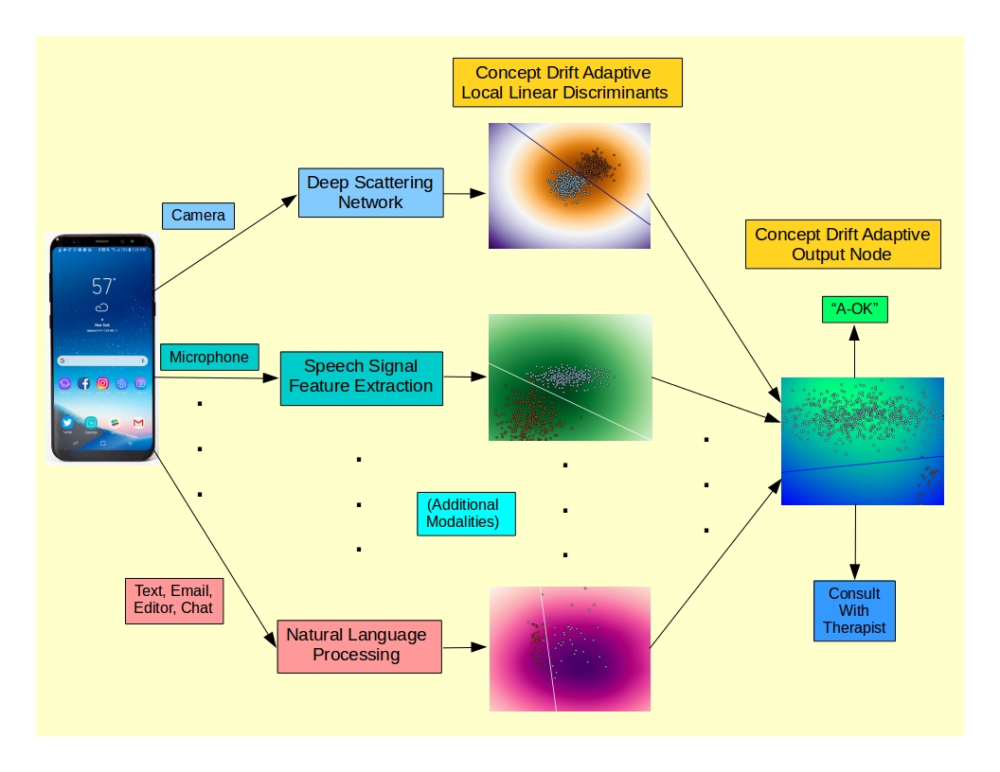

Concept Drift Adaptive Classifier-based Detection of Suicidal Ideation During Rehabilitation Using Multi-Modal Feature Data Continuously Acquired from Smartphone Use: A Call for Collaboration



Note: The breadth and depth of this project, from the design and integration of signal, image and text processing for feature extraction, to development of the classifier architecture and training algorithms, to the process of collecting a database, and most importantly it's application in the rehabilitation setting requires collaboration with an institution having the interest to investigate the use of smartphone-based feature data acquisition and machine learning to addressing this critical issue affecting both patients and their families. Thanks to Spaulding Hospital, this Innovation Challenge has provided an opportunity to raise awareness of this issue. This submission is nothing more than a proposal made in the hope sparking interest, and hopefully initiating a collaboration to develop and test a system based on these overall principles. 

Recent research indicates a heightened risk of suicide among those who have acquired a physical disability or sustained a traumatic brain injury. Machine learning techniques based on large margin perceptrons (e.g., SVMs) are sensitive to task-relevant features and robust to both noise and irrelevant features. Such techniques can be applied to the detection of critical points in the psyche of a patient in rehabilitation who is moving in the direction of suicidal ideation. Relevant feature data can be acquired continuously from smartphone sensors and patterns of active usage and processed by a classifier trained to demarcate the transition from healthy to suicidal patterns of thought and behavior. 

The smartphone as a platform is well suited to this task. Feature data can be culled from a broad range of sources, including:
- Prosodics and other features of speech carrying information about feelings / emotion / affect
- Text and email messages (sentiment, content)
- Facial expression, eye movements
- Heart rate and heart rate variability
- Fine and coarse patterns of movement (GPS, accelerometer, typing rates & rhythms)
- Patterns of usage of smartphone apps (types, durations)

Due to close and frequent collaboration with therapists, patients in a rehabilitation setting are particularly accessible for collection of potentially relevant feature data. While applications are now appearing for smartphone-based recognition of affect and emotion for commercial purposes, or the delivery of mental health services to the general population, it is still the case that classifier performance is generally optimized when trained on data from a specific subset of a population with a focused goal. Even when the goal is the use of machine learning to detect suicidal “thought markers”, the full range of modalities with potential to indicate a drift towards suicidal ideation has not been explored as input data to be processed in real time. The goal of this project is therefore the prototyping and training of a binary classifier focused exclusively on patients with recently acquired physical disabilities or TBI in an intensive rehabilitation setting, utilizing the broadest range of potentially useful data available from the smartphone as a data acquisition platform. The focus on this particular group is based on the relatively higher risk of attempted suicide and the frequency of interaction with therapists, as an effective way of bootstrapping both the classifier and this application, which can be extended to a wider audience once the technique is proven to be effective. 

The limitation to binary classification is done to limit classifier complexity, make best use of the training data as it is acquired for this new database, and most importantly to focus exclusively on the task of detecting indications of suicidal ideation. The two classes will nominally represent categories like “well” and “marginal”, in order to generate a conservative decision boundary for initiation of earlier, more intensive therapist interaction, so as to intervene as early as possible in a patient's potential path towards a suicide attempt. Optimized use of the initially limited amount of training data will also be the result of using each distinct type of feature data (text, facial expression, heart rate, etc.) independently with sub-classifiers that act as “experts” for each type of feature data in a multi-view, mixture of experts model. This not only limits the trainable complexity of the overall classifier, improving generalization performance, it allows each expert / sub-classifier to function independently of the others – since, in the general case, the input modalities will be active at disjoint times. This particular variant of the mixture of experts architecture will also utilize integration in the time domain, allowing an alarm for therapist intervention to be generated from either a single sub-classifier (e.g., detection of what appears to be a suicide note sent by text or email or simply composed in an editor), or more subtle cues distributed across several input modalities, integrated over a sliding window in time. 

Two types of data are available for classifier training – results of ongoing mental health assessments (which can also be smartphone-based) and actual suicide attempts. Graded results from assessments can be used to give partial weight to feature vectors associated with both healthy and unhealthy states for classifier training. As the rate of successful completion of suicide attempts is low, attempts serve as distinct ground truth labels for feature vectors that are closest to the attempt in time and would be labeled with full weight. In order to provide utility to both patients and therapists in the earliest phase of this project, prior to the collection of sufficient data to initiate classifier training, the classifier in it's untrained form will operate as an outlier detector, simply using an isotropic decision boundary for each sub-classifier and for the overall output of the mixture of experts as well to detect significant departures from baseline behavior in any direction. This will be a bootstrapping process, as training data is acquired and the classifier is incrementally trained resulting in a transition to discriminative, task-relevant decision boundaries composed of a mixture of localized large margin / soft margin perceptrons or support vector machines (SVMs). The higher level of risk for this patient population, combined with frequent interaction with therapists, will provide rapid bootstrapping of the classifier. The final threshold of this ensemble classifier, defining the detection of "potential suicidal ideation/action," would be adjusted to err on the side of caution and early intervention in all phases of the evolution and operation of the classifier. 

Machine learning techniques appropriate to concept (pattern) drift will be applied to develop a user-adaptive classifier that tracks gradual shifts over time, allowing optimum detection of periods in time when intervention is advisable. A properly tuned adaptive classifier should be capable of dynamically following cyclical shifts in mood and topics of concern that are typical, and not indicative of a drift towards a pathological state, while at the same time being capable of detecting sudden shifts in a pathological direction; this sensitivity is critical due to the relatively impulsive nature of many suicide attempts. This is a distinct variant of the mixture of experts model using adaptive localization functions to track concept drift independently in each feature space. Each sub-classifier will also utilize wrapper-type bootstrapped cross-validation for feature selection using features extracted, where appropriate, from deep scattering networks. The use of deep scattering networks for feature extraction allows the evaluation of multi-scale wavelet features over multiple layers of wavelet analysis, in a front-end architecture similar to that of trainable deep networks. The advantages of deep scattering networks in this application are the fact that they are overcomplete transforms (important for classification) requiring no training (minimizing the need for very large databases) and are partially invariant to affine transformations of the data (necessary to process data like speech and facial images). Each “expert” sub-classifier is essentially self-gated due to the localization functions, only contributing to the ensemble output when a particular feature type (i.e., speech, text, etc.) is in a meaningful region of that feature space. A classifier using static decision boundaries will be one additional component of the ensemble, providing a back-up system for detection of consistent longer-term drifts towards dangerous psychological states.

The ultimate goal of this project will be to provide an open source, customizable classifier architecture and training algorithm, along with an open source database for any groups interested in using machine learning to address this issue, among the most serious in healthcare. 


 


## Welcome to GitHub Pages

You can use the [editor on GitHub](https://github.com/pdp1145/Smartphone_Based_Suicide_Prevention/edit/master/index.md) to maintain and preview the content for your website in Markdown files.

Whenever you commit to this repository, GitHub Pages will run [Jekyll](https://jekyllrb.com/) to rebuild the pages in your site, from the content in your Markdown files.

### Markdown

Markdown is a lightweight and easy-to-use syntax for styling your writing. It includes conventions for

```markdown
Syntax highlighted code block

# Header 1
## Header 2
### Header 3

- Bulleted
- List

1. Numbered
2. List

**Bold** and _Italic_ and `Code` text

[Link](url) and 
```

For more details see [GitHub Flavored Markdown](https://guides.github.com/features/mastering-markdown/).

### Jekyll Themes

Your Pages site will use the layout and styles from the Jekyll theme you have selected in your [repository settings](https://github.com/pdp1145/Smartphone_Based_Suicide_Prevention/settings). The name of this theme is saved in the Jekyll `_config.yml` configuration file.

### Support or Contact

Having trouble with Pages? Check out our [documentation](https://help.github.com/categories/github-pages-basics/) or [contact support](https://github.com/contact) and we’ll help you sort it out.
